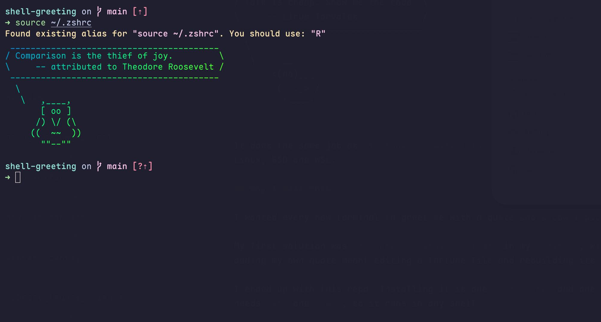

# shell-greeting

Show a random quote with a random graphic every time you open a terminal, in one of four flavors: classic ASCII art, pixel art, braille line art or real images.



It does the same job as `fortune | cowsay | lolcat` in one small script, without installing any of them. It only needs POSIX `sh` and `awk`, so it works the same in zsh, bash, fish, dash and ksh, on macOS, Linux, BSD and WSL.

## Installation

Clone the repository wherever you keep tools. This README uses `~/.local/share/shell-greeting`:

```sh
git clone https://github.com/t18n/shell-greeting.git ~/.local/share/shell-greeting
```

Try it:

```sh
~/.local/share/shell-greeting/greeting
```

Leave the folder together: the script looks for `quotes/` and `graphics/` next to itself. To run it from somewhere else, call it by its full path or make an alias (see below). A symlink won't work, because the script would look for `quotes/` and `graphics/` in the symlink's folder instead.

## Why I made this

I wanted every new terminal to greet me with a quote and a cow I picked, and I wanted it simple to install and easy to manage.

My first solution was `fortune | cowsay | lolcat` in my `.zshrc`, with a random cow from the [cowfiles](https://github.com/bkendzior/cowfiles) collection. It worked, but it meant installing three packages, and adding my own quote meant editing a fortune file and rebuilding its index with `strfile`.

I ended up with this repo. Installing it is one `git clone` and one line in your shell's startup file. The quotes and graphics are plain files in folders, so managing them is just editing files. It only needs `sh` and `awk`, so it runs in any shell.

## Features

- Four flavors, each with its own look:

  | Flavor | Graphics | Style |
  | --- | --- | --- |
  | `art` | 113 ASCII characters, animals and objects in `graphics/art/` | Classic cowsay bubble with a lolcat-style rainbow on every letter |
  | `pixel` | 16 pixel-art sprites in `graphics/pixel/` | Rounded box in soft pastels, sprites in full color |
  | `braille` | 16 braille line drawings in `graphics/braille/` | Thin box with one rainbow color per row |
  | `image` | 20 illustrations in `graphics/images/` | Minimal caption card above a real picture |

- 186 curated quotes in 7 topics: programming, innovation, business, startups, science, wisdom and humor.
- A greeting that fits the time of day ("Good morning", "Evening, wrapping up?", "Working late?"), using your login name.
- One random fact under the graphic: the day of the week, your uptime (with a restart hint after 14 days), your disk space when it's over 80% full, or how many terminals you've opened today.
- About 1 greeting in 50 is a rare shiny one, painted in solid gold.
- Holiday characters: only spooky ones appear from October 25 to 31, and Santa, the snowman and the elf from December 20 to 26.
- Open a terminal between 1 and 5 a.m. and you get a nudge to go to bed instead of a quote.
- Every part is configurable: the flavor, how often each flavor comes up, and each of the extras above.
- About 20 ms per run (about 50 ms for real images), so your shell doesn't start noticeably slower.

## Requirements

- A POSIX `sh`, `awk` and `od`. These are already on macOS, Linux, BSD and WSL.
- A terminal with 256-color or 24-bit color support. The `pixel` and `braille` flavors also need a UTF-8 terminal, which almost every modern terminal is.
- For the `image` flavor: [`chafa`](https://hpjansson.org/chafa/) (`brew install chafa` or your package manager), or iTerm2 or WezTerm, which show images themselves. `chafa` picks the best method for your terminal: real images in Kitty, Ghostty, WezTerm, iTerm2 and terminals with Sixel support, and colored blocks everywhere else. Without either, the `image` flavor falls back to pixel art.
- Only for adding graphics from your own pictures: [ImageMagick](https://imagemagick.org) (`magick`).

## Show it when your shell starts

Add one line to your shell's startup file, then open a new terminal.

**zsh**, in `~/.zshrc`:

```zsh
~/.local/share/shell-greeting/greeting
```

If you use Powerlevel10k's instant prompt, put this line *above* the instant-prompt block, because instant prompt warns about output printed after it starts.

**bash**, in `~/.bashrc`:

```bash
~/.local/share/shell-greeting/greeting
```

On macOS, Terminal opens bash as a login shell, which reads `~/.bash_profile` instead. Make sure that file sources `~/.bashrc`, or put the line there.

**fish**, in `~/.config/fish/config.fish`:

```fish
if status is-interactive
    ~/.local/share/shell-greeting/greeting
end
```

**sh, dash or ksh**, in `~/.profile`, or in the file your `$ENV` points to:

```sh
case $- in *i*) ~/.local/share/shell-greeting/greeting ;; esac
```

The `case` check makes sure the greeting only prints in interactive shells, not when a script or `scp` starts a shell.

**Any shell, on demand:** add an alias so you can type `greeting` whenever you want another one:

```sh
alias greeting="$HOME/.local/share/shell-greeting/greeting"
```

In fish, use `alias greeting ~/.local/share/shell-greeting/greeting`.

## Configuration

Set any of these variables in your shell's startup file, before the line that runs the greeting. Everything has a default, so you only set what you want to change.

| Variable | Default | What it does |
| --- | --- | --- |
| `GREETING_FLAVOR` | `random` | `art`, `pixel`, `braille`, `image` or `random` |
| `GREETING_WEIGHTS` | `art:4 pixel:3 braille:2 image:1` | How often each flavor comes up in `random`. A flavor left out, or set to `0`, never shows. |
| `GREETING_TOPICS` | all topics | Quote topics to use, separated by spaces or commas: `programming`, `innovation`, `business`, `startups`, `science`, `wisdom`, `humor`, plus any file you add to `quotes/` |
| `GREETING_DIRS` | `~/.config/shell-greeting` | Your own content folders, separated by `:` (see [Your own content](#your-own-content)). Set it empty to use only the bundled content. |
| `GREETING_NAME` | your login name | The name in the time-of-day greeting |
| `GREETING_HELLO` | `on` | `off` hides the time-of-day greeting |
| `GREETING_FACTS` | `on` | `off` hides the fact line. It also stops the terminal counter, so nothing is written to disk. |
| `GREETING_SHINY` | `50` | A shiny greeting comes up 1 time in this many. `0` turns it off, `1` makes every greeting shiny. |
| `GREETING_HOLIDAYS` | `on` | `off` turns off the Halloween and Christmas characters |
| `GREETING_NIGHT` | `on` | `off` turns off the late-night nudge |
| `GREETING_IMAGE_SIZE` | `24x12` | Size of real images, in columns by rows |

For example, in zsh, bash, sh or ksh:

```sh
export GREETING_FLAVOR=random
export GREETING_WEIGHTS="pixel:3 image:2 art:1"
export GREETING_NAME="Sam"
export GREETING_TOPICS="programming startups humor"
export GREETING_SHINY=20
```

In fish:

```fish
set -gx GREETING_FLAVOR pixel
set -gx GREETING_SHINY 0
```

For a single run, pass the flavor as an option instead. It wins over `GREETING_FLAVOR`:

```sh
~/.local/share/shell-greeting/greeting --flavor braille
```

`--list` shows which content folders, quote topics and graphics the script finds, and whether real images can be shown in this terminal. `--help` lists every option, and `--version` shows the version.

**Over SSH:** set the flavor in the startup file on the server, like anywhere else. Real images usually show as colored blocks over SSH, because the server can't tell what your local terminal supports; Kitty is an exception, since its `TERM` setting is passed along. Inside tmux, images only work through `chafa`'s colored blocks. `art` or `pixel` look the same everywhere, which makes them the safe choice on remote machines.

### What it reads about your computer

Everything stays on your machine, and nothing is sent anywhere. For the fact line, the script runs `date`, `uptime` and `df` (for your home folder's disk), and it never reads your shell history. The only thing it writes is `~/.local/state/shell-greeting/count` (or under `$XDG_STATE_HOME` if you set it). That file holds one line, today's date and how many terminals you've opened today. If the folder isn't writable, the count is skipped. With `GREETING_FACTS=off`, it doesn't run `uptime` or `df` and writes nothing.

### Colors

The script uses 24-bit color when `$COLORTERM` is `truecolor` or `24bit`, and 256 colors otherwise. Most modern terminals set `COLORTERM` themselves. If yours supports 24-bit color but the colors look banded, add `export COLORTERM=truecolor` to your shell's startup file.

To turn colors off, set [`NO_COLOR`](https://no-color.org) to any value. The `pixel` and `image` flavors are made of color, so they fall back to ASCII art then; `braille` still works.

## Customizing

### Quotes

Quotes live in `quotes/`, one file per topic (`programming.txt`, `startups.txt` and so on), in the same format `fortune` uses: write each entry, then a line containing only `%`. A new `.txt` file in `quotes/` becomes a new topic.

```
The quote text, as long as you like. Long lines are wrapped automatically.
    -- Author
%
```

Existing `fortune` files use this format, so you can paste their contents in. If their lines are already wrapped at about 72 characters, re-wrap them, or they'll break unevenly at the 50-character bubble width.

### Graphics

Each flavor has its own folder under `graphics/`. A new file shows up the next time the greeting runs.

To preview any graphic, pass it as an argument. With one or more graphic files as arguments, the script picks only from those, and the flavor comes from the folder:

```sh
~/.local/share/shell-greeting/greeting ~/.local/share/shell-greeting/graphics/pixel/cat.txt
```

**ASCII art** (`graphics/art/*.txt`): plain text, printed exactly as you draw it, right under the bubble. Start with two `\` lines, so the bubble's tail leads into your drawing:

```
  \
   \   /\__/\
       ( oo )
```

If you have cowsay installed, you can convert a `.cow` file from another collection by rendering it once and dropping the three bubble lines:

```sh
cowsay -f some.cow x | tail -n +4 > ~/.local/share/shell-greeting/graphics/art/some.txt
```

**Pixel art** (`graphics/pixel/*.txt`): a palette, a line with `---`, then the pixels, one character each. `.` is transparent. Two pixel rows share one line of the terminal, so a 16×16 sprite shows as 16 columns by 8 rows. Keep sprites within 24×16 pixels.

```
. transparent
k #1b1b1b
o #f28c28
w #ffffff
---
..k......k..
.kok....kok.
kowwkoowwkok
```

To turn a picture into pixel art, for example a sprite exported from a pixel editor like Piskel or Aseprite:

```sh
tools/png-to-pixel sprite.png > graphics/pixel/sprite.txt
```

**Braille art** (`graphics/braille/*.txt`): braille characters, printed as they are. Each character holds a 2×4 grid of dots, so 30 columns by 8 rows gives 60×32 dots. The easiest way to make one is to draw black lines on a white background and convert the picture:

```sh
tools/png-to-braille drawing.png > graphics/braille/drawing.txt
```

**Real images** (`graphics/images/*.png` or `.jpg`): drop pictures in. Bold, simple pictures with a transparent background look best at this small size.

Both converters need ImageMagick and only run when you add graphics, never when the greeting runs. They shrink the picture to fit, and take an optional maximum width and height (in pixels for pixel art, dots for braille) after the file name.

### Your own content

Keep your own quotes and graphics outside the repository, so `git pull` never conflicts with them. The script mixes in everything from `~/.config/shell-greeting` (or `$XDG_CONFIG_HOME/shell-greeting`), which uses the same layout as the repository:

```
~/.config/shell-greeting/
  quotes/my-favorites.txt
  graphics/art/my-cat.txt
  graphics/pixel/my-sprite.txt
  graphics/braille/my-drawing.txt
  graphics/images/my-photo.png
```

Every part is optional. A quote file there is a topic like any other, so `GREETING_TOPICS=my-favorites` shows only your own quotes. To use other folders, list them in `GREETING_DIRS`, separated by `:`.

### With an AI agent

Two skills add quotes and graphics following the rules above, check their work, and update the counts in this README. In Claude Code, run them from the repository folder:

```
/generate-quotes 5 quotes about debugging
/generate-graphics pixel art of a cactus and an ASCII rocket
```

Other agents, such as Codex or Cursor, read `AGENTS.md`, which points them to the same skill files in `.claude/skills/`.

## Uninstalling

Remove the line from your shell's startup file, then delete the folder and the terminal counter:

```sh
rm -rf ~/.local/share/shell-greeting ~/.local/state/shell-greeting
```

## AI attribution

Built with Claude, Anthropic's AI model, which wrote the script, tools and skills, drew all 165 graphics (113 ASCII, 16 pixel art, 16 braille and 20 illustrations) and picked the quotes; the words belong to the people credited, and "attributed to" marks an uncertain source.

## Acknowledgments

Inspired by the classic trio of [fortune](https://en.wikipedia.org/wiki/Fortune_(Unix)), [cowsay](https://en.wikipedia.org/wiki/Cowsay) by Tony Monroe, and [lolcat](https://github.com/busyloop/lolcat), whose rainbow formula this script reuses. Real images are drawn by [chafa](https://hpjansson.org/chafa/) by Hans Petter Jansson when it's installed.

## License

MIT. See [`LICENSE`](LICENSE).
